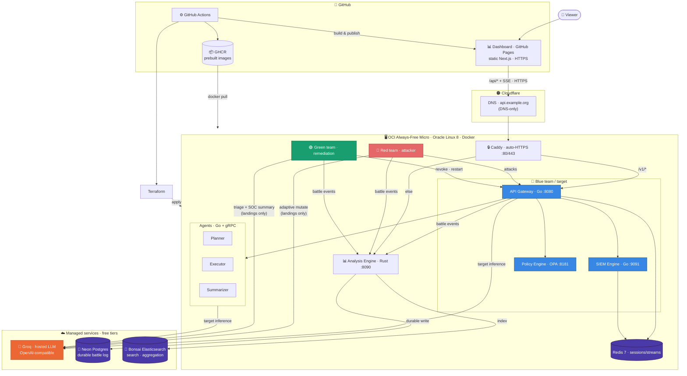

#  Agentic Defense Matrix (ADM)

> **The Unified Blue/Green Team Architecture for Agentic AI Systems**

一個針對具備自主規劃與工具調用（Tool-calling）能力的 Agentic AI 所設計的縱深防禦系統。本專案屏棄傳統僅依賴「提示詞過濾」的無效防護，透過作業系統底層遙測（Telemetry）、動態權限管控與狀態感知 SIEM，徹底限制 AI 代理的爆炸半徑。

---

## 🔴🔵🟢 Live Demo

A full red vs. blue vs. green exercise runs continuously on free-tier cloud:

- **Demo video https://youtu.be/K9QCi-esu_g

- **Dashboard (realtime):** https://jest-test-team.github.io/Agentic-Defense-Matrix-ADM/
  — every tech-stack component's health, LLM-provider status (Groq → X.AI failover),
  battle scoreboard with click-through session detail, **successful attack chains**
  (adaptive LLM follow-ups + green SOC summaries), per-technique breakdown, live
  event feed (English / 繁體中文). Subpages: **🔎 Search** (full-text Elasticsearch
  over every event) and **🎯 Matrix** (all 10,000 enumerated attack variants).
- **API (HTTPS):** `https://api.dennisleehappy.org` —
  `/api/stats`, `/api/timeline`, `/api/chains`, `/api/stream` (SSE), `/api/system`
  (per-component health), `/api/llm` (provider status), `/api/latency` (δ/κ
  distributions), `/api/search`, `/health`, `/ready`.

The red team fires thousands of adversarial prompts and tool-call attempts at the
gateway (deterministic corpus; on a landing, optional hosted-LLM adaptive next
step within an attack chain); the blue team blocks them at the boundary; the green
team remediates landings with optional LLM triage and a SOC summary. Every event
is logged to Postgres and scored live. See
**[Live Deployment — Infrastructure & Services](docs/architecture/live-deployment.md)**
for the full architecture (OCI micro + Neon + Bonsai + Groq→X.AI + Caddy + GitHub Pages),
and **[Battle Orchestration](docs/battle-orchestration.md)** / **[ADR-008](docs/adr/008-llm-red-green-teams.md)**
for how the exercise and LLM-assisted red/green paths work.

### 🎓 From artifact to research

ADM is also framed as a **security-research program** (AISec/NDSS/USENIX/S&P-workshop
grade): the shift from *how it works* to *why it holds and where the limits are*. Two
contributions — **intent-drift detection** (C1) and **asymmetric containment** (C2) —
are formalized and backed by **runnable experiments** with real numbers:

| experiment | command | headline |
|---|---|---|
| embedding-φ ablation | `go run ./cmd/ablation` | embedding 51.5% vs keyword 13.8% detect; +100 pts on obfuscation |
| window-W sweep (theory vs measured) | `go run ./cmd/sweep` | FPR 38%→0% & detection 76%→100%, inside Eq. 2/3 bounds |
| δ/κ instrumentation | `go run ./cmd/latency` | detection p50 33 µs; containment primitive p50 0.5 ms |
| overhead / Pareto (≤5%) | `go run ./cmd/overhead` | lock-free 2× cheaper than mutex; <5% CPU to ~160k ev/s |
| SOTA baseline (Llama Guard) | `go run ./cmd/baseline` | asymmetry α ≈ 10³–10⁴× |

See **[docs/research/](docs/research/)** for the formalization, evaluation plan,
reviewer rebuttals, and results docs.

---

## Architecture (infrastructure & services)



**Legend:** 🔴 red attacks · 🔵 blue detects & blocks · 🟢 green remediates ·
📊 the analysis engine scores everything and serves the dashboard. The 1 GB micro
runs the containers; Postgres, Elasticsearch, the LLM, and image builds are
offloaded to free managed clouds. Full detail:
**[Live Deployment — Infrastructure & Services](docs/architecture/live-deployment.md)**.

---

## Teams × hosted LLM — who calls inference, and when

All hosted inference uses the same client (`pkg/ollama` → Groq primary, X.AI
fallback). Flags: `ADM_RED_LLM`, `ADM_GREEN_LLM`. See [ADR-008](docs/adr/008-llm-red-green-teams.md).

| Team | Role in the exercise | Uses hosted LLM? | When / for what | Does **not** use LLM for |
|------|----------------------|------------------|-----------------|---------------------------|
| 🔴 **Red** (`redteam_agent`) | Attacker | **Yes, optionally** | Only after a **landing** (`outcome=allowed`): `AdaptiveMutate` picks next RT technique + mutated payload; continues the same `chain_id` (≤ `ADM_CHAIN_MAX_STEPS`) | Day-to-day corpus fire (deterministic 10k variants); judging “blocked vs allowed” (HTTP status / body heuristics) |
| 🔵 **Blue** (gateway, SIEM, OPA, agents) | Target + defender | **Yes** (gateway / planner / summarizer) | When a request **passes** the L7 semantic + policy boundary and needs a chat/plan/summary completion | **Boundary detection itself** — semantic analyzer + OPA are local, no LLM; SIEM correlation is rule-based |
| 🟢 **Green** (`greenteam_agent`) | Remediator | **Yes, optionally** | On each landing: `TriageRemediation` → severity, whether to revoke, which agent(s) to restart, SOC `summary` text for the dashboard | Executing revoke/restart (still HTTP + Docker API); choosing infra containers (hard whitelist) |

**Quota rule of thumb:** corpus attacks at ~500 ms do **not** burn Groq tokens; only landings (and green triage for those landings) do. LLM failure → red skips adaptive follow-up; green falls back to always-revoke + restart by attack target.

---

## Compromise boundary — what ADM treats as “landed / compromised”

ADM scores **session-scoped landings**, not “the whole fleet is owned.” Boundaries:

| Verdict | Concrete signal | Meaning | What happens next |
|---------|-----------------|---------|-------------------|
| **Blocked (not compromised)** | Gateway returns 4xx / empty / policy-deny; red event `outcome=blocked` | Attack died at the **API boundary** (semantic and/or OPA). Session is not treated as compromised. | Counted on scoreboard; no green remediation; no attack-chain upsert for ordinary blocked corpus shots |
| **Landed (session compromised)** | Red classifies `outcome=allowed` (2xx with content that is not an explicit block) | The request **reached the target path** (and often the hosted LLM). That **`session_id` is treated as compromised** for remediation purposes. | Red may start/continue an **attack chain**; green triages that session; analysis stores the chain |
| **Detected** | Blue/SIEM `kind=defense`, `outcome=detected` | Correlation / alert without necessarily proving L7 allow | Raises detection rate; green may still act if a concurrent landing exists |
| **Contained** | Green `kind=remediation` with `revoked` / `restarted` (chain `status=contained`) | Compromised **session** revoked and/or labelled agent container(s) restarted | Residual risk clears for that session; chain gets `remediation_summary` |
| **Residual risk** | Landed session with **no** remediation yet | Still treated as an open compromise for that session | Dashboard residual-risk tile |

**Hard scope of “compromised” (important):**

- **In scope:** the offending **`session_id`**, and agent containers labelled `adm.role=agent` that triage names (`planner` / `executor` / `summarizer` only).
- **Out of scope / never treated as kill targets:** gateway, SIEM, Redis, analysis, Neon, Caddy, OPA, infra volumes — green **must not** restart these even if the LLM suggests them.
- **Not automatic “host compromised”:** a landing does **not** mean the OCI VM or Postgres is owned; it means the **agent session** crossed the L7 allow path and green must cut that session’s blast radius.
- **Attack chains:** a successful chain is history of one adaptive campaign (`chain_id`); dashboard **Successful attack chains** lists landings that earned durable rows in `attack_chains`.

---

## Objective

Build a defense matrix covering L7 API Gateway to OS Endpoint layers. Ensure that when agents face **Indirect Prompt Injection (Data Poisoning)**, **Confused Deputy Attacks**, or **State Drift**, the system actively identifies semantic anomalies and blocks unauthorized syscalls and data exfiltration at the OS level.

## Methods

Blue Team detection + Green Team isolation:

1. **Cross-dimensional Telemetry:** Gateway semantic analysis combined with OS-level (WFP / macOS Endpoint Security) process/network interception.
2. **Stateful SIEM:** Time-series correlation of natural language intent with underlying syscalls.
3. **Zero Trust & Micro-segmentation:** Dynamic IAM privilege downgrade with ephemeral agent sandboxing.

## Constraints

- **Performance:** Network interception and SIEM correlation must add < 50ms latency.
- **Stateless Agents:** All state managed externally for instant container destruction.
- **Egress Filtering:** Default-deny outbound except whitelisted APIs.

---

## Tech Stack

| Component | Technology | Purpose |
|-----------|-----------|---------|
| API Gateway | Go (Echo) | Request interception, semantic analysis, routing |
| Agent Services | Go + gRPC | Planner, Executor, Summarizer (separate containers) |
| LLM Backend | Groq → X.AI (live) / Ollama (local A1) | Target inference + red adaptive mutate + green triage |
| Endpoint Watchdog | Rust | macOS ES + Windows WFP syscall interception |
| SIEM Engine | Go | Correlation engine + Redis Streams |
| Policy Engine | OPA + SPIRE | Rego policies + workload identity |
| Sandboxing | Docker API | Ephemeral per-agent containers |
| Storage | Redis 7 | SIEM hot path (7d hot / 180d cold) |
| Observability | OpenTelemetry | Traces, metrics, logs |
| CI/CD | GitHub Actions | Matrix build: windows/amd64, darwin/amd64+arm64, linux/amd64 |

---

## Repository Structure

```
agentic-defense-matrix/
├── .github/
│   └── workflows/
│       ├── ci.yml                 # Go & Rust tests + lint
│       ├── release.yml            # Cross-platform packaging
│       └── red_team_fuzz.yml      # Red team attack suite
├── cmd/
│   ├── gateway/                   # API Gateway + semantic middleware
│   ├── siem_engine/               # SIEM correlation engine
│   ├── control_plane/             # Auto-update server
│   ├── redteam_agent/             # Red team: 10k corpus + LLM adaptive mutation / chains
│   ├── greenteam_agent/           # Green team: LLM triage + revoke + contain
│   ├── agent/{planner,executor,summarizer}/   # gRPC agent services
│   ├── corpus_dump/               # Renders the corpus → dashboard/public/corpus.json
│   ├── ablation/                  # C1: embedding-φ vs keyword ablation
│   ├── sweep/                     # C1: window-W sweep vs Eq. 2/3 bounds
│   ├── latency/                   # C2: δ/κ instrumentation (detection & containment)
│   ├── overhead/                  # C2: lock-free vs mutex overhead / Pareto rig
│   └── baseline/                  # SOTA: ADM drift vs Llama Guard + asymmetry α
├── pkg/
│   ├── auth/                      # OPA + SPIRE client, JWT management
│   ├── semantic/                  # Intent-drift detection: analyzer + pluggable φ
│   ├── telemetry/                 # OTel helpers + LatencyRecorder (percentile δ/κ)
│   ├── ollama/                    # OpenAI-compatible LLM client (Groq → X.AI failover)
│   ├── llmops/                    # Red AdaptiveMutate + green TriageRemediation
│   ├── redteam/                   # Deterministic 10,000-variant attack corpus
│   ├── battle/                    # Battle event schema + emitter
│   ├── policy/                    # OPA Rego evaluation client
│   ├── ringbuffer/                # Lock-free ring buffer (SIEM hot path)
│   └── proto/                     # Protobuf service definitions
├── agents/
│   └── schemas/                   # OpenAI-compatible tool definitions
├── daemon_watchdog/               # Rust endpoint watchdog
│   ├── Cargo.toml
│   └── src/
│       ├── main.rs
│       ├── wfp_filter.rs          # Windows Filtering Platform
│       ├── macos_es.rs            # macOS Endpoint Security
│       ├── egress_blocker.rs      # Dynamic egress blocking
│       ├── policy_enforcer.rs     # OPA policy evaluation
│       └── telemetry.rs           # OTel event export
├── deploy/
│   ├── docker-compose.yml         # Full stack orchestration
│   ├── Dockerfile.services        # Multi-stage Go build
│   ├── Dockerfile.rust            # Rust watchdog build
│   ├── Dockerfile.opa             # OPA sidecar
│   ├── watchdog.toml              # Watchdog configuration
│   ├── otel-collector.yaml        # OTel Collector config
│   ├── packaging/                 # Platform installers
│   │   ├── windows/               # MSI + PowerShell
│   │   ├── macos/                 # .pkg + launchd
│   │   └── linux/                 # tar.gz + systemd
│   └── spire/                     # SPIRE + OPA policies
├── docs/
│   ├── architecture/
│   │   ├── system-overview.md     # Mermaid architecture diagrams
│   │   ├── c4-container.puml      # PlantUML C4 model
│   │   ├── deployment.md          # Deployment architecture
│   │   ├── data-flow.md           # Data flow + battle / LLM roles
│   │   ├── live-deployment.md     # OCI + Neon + Groq topology
│   │   └── security.md            # Security architecture
│   ├── battle-orchestration.md    # Red / blue / green exercise
│   ├── threat-model.md            # MITRE ATLAS threat mapping
│   ├── research/                  # Formalization + experiment results
│   └── adr/                       # Architecture Decision Records
│       ├── 001-opa-spire-auth.md
│       ├── 002-redis-streams-siem.md
│       ├── 003-separate-agent-services.md
│       ├── 004-rust-watchdog.md
│       ├── 005-ollama-llm.md
│       ├── 006-hosted-llm-failover.md
│       ├── 007-intent-drift-research.md
│       └── 008-llm-red-green-teams.md
├── analysis/                      # Rust battle-analysis engine (axum + Postgres + Elastic) + dashboard API
├── dashboard/                     # Realtime Next.js dashboard (static, GitHub Pages, EN/繁中)
├── worker/                        # (deprecated) Cloudflare Worker HTTPS proxy — superseded by Caddy
├── tests/
│   ├── integration/               # Blue/green team integration tests
│   └── redteam/                   # Red team attack harnesses
├── scripts/
│   └── setup-dev.sh               # Development environment setup
├── .editorconfig
├── .golangci.yml
├── Makefile
├── buf.yaml                       # Protobuf lint config
├── buf.gen.yaml                   # Protobuf code generation
├── go.mod
└── README.md
```

---

## Implementation Methods

1. **L7 Semantic Defense (Gateway):** Go middleware intercepts all agent requests, computes short-window semantic similarity to block automated probing.
2. **OS Behavior Containment (Endpoint):** Rust watchdog daemon with WFP/ES filters binds agent socket connections to session IDs.
3. **Green Team Auto-Response:** On a landing, optional LLM triage → Gateway revokes session IAM → Docker restart of selected `adm.role=agent` containers; SOC summary written to the battle log / attack chain.

---

## Implementation Plan

### Phase 1: Architecture & Sandboxing (Weeks 1-2)
- Separate agent dialogue and execution modules
- Build Docker ephemeral execution environments
- Ollama wrapper with tool-calling support
- Protobuf service definitions
- Docker Compose orchestration

### Phase 2: Endpoint Interceptor (Weeks 3-4)
- Rust watchdog with macOS Endpoint Security
- Windows WFP filter implementation
- Egress blocking with dynamic whitelisting
- Cross-platform packaging (MSI, .pkg, tar.gz)

### Phase 3: SIEM Correlation Engine (Weeks 5-6)
- Lock-free ring buffer for hot-path ingestion
- Redis Streams for event persistence
- MITRE ATLAS-based correlation rules
- OTel instrumentation

### Phase 4: Dynamic Permissions & Auto-Response (Weeks 7-8)
- OPA + SPIRE integration
- Token revocation on threat detection
- Egress drop on anomalous behavior
- End-to-end integration testing

---

## Acceptance Criteria

| Stage | Attack (Red Team) | Expected Defense (Blue/Green) | Pass Criteria |
|-------|-------------------|-------------------------------|---------------|
| Stage 1: API Boundary | High-frequency semantic prompt injection | Gateway detects semantic anomaly | Rate limit triggered, 95% probes blocked |
| Stage 2: Logic Abuse | Confused deputy: chain read_secret → external_send | Watchdog captures anomaly, SIEM fires rule | IAM revoked, egress denied by sandbox |
| Stage 3: System Penetration | RAG poisoning → reverse shell spawn | macOS ES / WFP intercepts unauthorized exec (e.g., `bash -i`) | Process creation fails, container destroyed |

---

## Red Team Test Suite

These **30 base techniques** are the taxonomy. At runtime the corpus generator
(`pkg/redteam`) expands each one through deterministic mutations (base64/hex
encoding, homoglyphs, zero-width injection, multilingual, nesting, obfuscation,
paraphrase…) into an enumerated campaign of up to **10 000 concrete variants —
`RT-00001 … RT-10000`** (capacity ~11 400). The continuous attacker
(`cmd/redteam_agent`) fires them at the gateway; each variant keeps its base
technique family for grouping in the dashboard. Reproducible from a fixed seed.

Located in `tests/redteam/`, implemented in Go/Rust:

| ID | Attack | Technique |
|----|--------|-----------|
| RT-001 | Prompt Injection | Indirect injection via RAG context |
| RT-002 | Tool Chaining | read_secret → external_send chain |
| RT-003 | RAG Poisoning | Inject malicious URLs into knowledge base |
| RT-004 | Reverse Shell | `bash -i >& /dev/tcp/...` via tool call |
| RT-005 | Confused Deputy | Trick agent into privilege escalation |
| RT-006 | Token Theft | Replay captured JWT |
| RT-007 | Egress Exfiltration | DNS tunnel / HTTP POST to external |
| RT-008 | Container Escape | Mount host filesystem attempts |
| RT-009 | Rate Abuse | 1000 req/min automated probing |
| RT-010 | State Drift | Modify agent context mid-session |
| RT-011 | LLM Supply Chain | Compromised Ollama model |
| RT-012 | Log Injection | Crafted payloads in user input |
| RT-013 | TOCTOU Race | Race condition in policy check |
| RT-014 | DNS Rebinding | Bypass egress filter via DNS |
| RT-015 | Privilege Escalation | Exploit Watchdog → root |
| RT-016 | Indirect Tool Output | Inject malicious instructions in tool output |
| RT-017 | Multi-Turn Context | Build trust then exploit across turns |
| RT-018 | Encoding Injection | Base64/hex encoded payloads |
| RT-019 | Multi-Language | Injection in multiple languages |
| RT-020 | Nested Injection | Nested system/user/assistant markers |
| RT-021 | Social Engineering | Fake admin/emergency commands |
| RT-022 | Payload Obfuscation | Variable splitting, concatenation |
| RT-023 | Supply Chain | Malicious package installation |
| RT-024 | Time-Based | Delayed trigger injection |
| RT-025 | Resource Exhaustion | Large payloads, concurrent requests |
| RT-026 | Memory Poisoning | Poison agent conversation memory |
| RT-027 | Cross-Session | Contaminate other sessions |
| RT-028 | Token Extraction | Extract API keys/tokens |
| RT-029 | Denial of Service | Excessive token generation |
| RT-030 | Side Channel | Data exfiltration via encoding |

---

## Quick Start

```bash
# Setup development environment
./scripts/setup-dev.sh

# Start infrastructure
docker compose up -d redis ollama

# Pull LLM model
ollama pull llama3.1:8b

# Build everything
make build

# Run tests
make test

# Start full stack
make docker-up
```

---

## Auto-Update System

Gateway includes built-in auto-update client that polls GitHub Releases:

- **Background check**: Every 1 hour, checks for new releases
- **SHA256 verification**: Verifies checksums before applying
- **Binary replacement**: Downloads and replaces binaries in-place
- **Service restart**: Restarts the service after update (systemd/launchd)

**Admin endpoints:**
- `GET /v1/version` — Current version
- `POST /v1/admin/update/check` — Check for updates

**Environment variables:**
- `ADM_GITHUB_OWNER` — GitHub repo owner (default: `Jest-Test-Team`)
- `ADM_GITHUB_REPO` — GitHub repo name (default: `Agentic-Defense-Matrix-ADM-`)

## Deployment

### Local battle stack (red + blue + green + analysis)

Prereqs: Docker, Neon `DATABASE_URL` (or local Postgres), Groq key (and optional X.AI fallback).

```bash
# Env (example)
export DATABASE_URL='postgres://…@….neon.tech/adm?sslmode=require'
export ADM_LLM_MODE=openai
export ADM_LLM_BASE_URL=https://api.groq.com/openai/v1
export ADM_LLM_API_KEY=gsk_…
export ADM_MODEL=llama-3.1-8b-instant          # or your Groq model id
export ADM_LLM_FALLBACK_BASE_URL=https://api.x.ai/v1   # optional
export ADM_LLM_FALLBACK_API_KEY=xai-…                  # optional
export ADM_RED_LLM=true
export ADM_GREEN_LLM=true
export ADM_CHAIN_MAX_STEPS=5

# Base stack + battle overlay (redteam, greenteam, analysis)
make battle-up
make battle-logs          # follow red / green / analysis
# Analysis API: http://localhost:8090
# Gateway:      http://localhost:8080
# Chains:       curl -s 'http://localhost:8090/api/chains?status=landed' | jq .
make battle-down
```

Base-only (no continuous red/green):

```bash
docker compose up -d
# or: docker compose -f docker-compose.yml -f docker-compose.dev.yml up -d
```

### Oracle Cloud (live demo path)

1. Set GitHub secrets: OCI credentials, `ADM_SSH_PUBLIC_KEY`, **`GROQ_API_KEY`** (and optional `XAI_API_KEY`), Neon `DATABASE_URL` / Elastic URL as wired by Terraform / `battle.env`.
2. Run **Terraform OCI** workflow (`.github/workflows/terraform-oci.yml`) → `apply`.
3. Cloud-init pulls GHCR images and runs `battle-up.sh` on the micro.
4. Point DNS + `ADM_API_DOMAIN` for Caddy HTTPS; open the Pages dashboard with `?api=https://your-api-host`.

Day-2 ops: [docs/instruction.md](docs/instruction.md) (`status.sh` / `update.sh` / smoke curls including `/api/chains`).

### Platform Installers

| Platform | Installer | Service Manager |
|----------|-----------|-----------------|
| Windows | `deploy/packaging/windows/install.ps1` | Windows Service |
| macOS | `deploy/packaging/macos/install.sh` | launchd |
| Linux | `deploy/packaging/linux/install.sh` | systemd |

### Oracle Cloud Terraform (secrets)

GitHub Actions workflow: `.github/workflows/terraform-oci.yml`

Required repository secrets:

| Secret | Description |
|--------|-------------|
| `OCI_TENANCY_OCID` | OCI tenancy OCID |
| `OCI_USER_OCID` | OCI API user OCID |
| `OCI_FINGERPRINT` | OCI API key fingerprint |
| `OCI_PRIVATE_KEY` | PEM contents of the OCI API private key |
| `ADM_SSH_PUBLIC_KEY` | SSH public key installed on the ADM instance |
| `GROQ_API_KEY` | Primary hosted LLM (wired to `ADM_LLM_API_KEY`) |

Optional repository settings:

| Setting | Type | Default |
|---------|------|---------|
| `OCI_REGION` | Secret | `us-ashburn-1` |
| `ADM_EXISTING_SUBNET_ID` | Variable | Empty; set to reuse an existing OCI subnet instead of creating a VCN |
| `ADM_OCPUS` | Variable | `4` |
| `ADM_MEMORY_IN_GBS` | Variable | `24` |
| `ADM_VOLUME_SIZE_GBS` | Variable | `100` |
| `ADM_DOCKER_COMPOSE_VERSION` | Variable | `v2.29.1` |

Pull requests run `terraform fmt`, `init`, and `validate`. Pushes to `main` run a plan. Use the manual **Terraform OCI** workflow dispatch with `action=apply` and `auto_approve=true` to deploy to OCI, or `action=destroy` and `auto_approve=true` to tear it down.

The current Terraform backend is local, so the workflow caches `terraform.tfstate` between manual runs. For long-lived or shared infrastructure, move state to a real remote backend before relying on this from multiple branches or operators.

### Manual Installation

```bash
# Build from source
make build

# Install binaries
sudo cp bin/* /usr/local/bin/

# Create systemd service
sudo cp deploy/packaging/linux/adm.service /etc/systemd/system/
sudo systemctl daemon-reload
sudo systemctl enable adm
sudo systemctl start adm
```

## Documentation

- [Live Deployment — Infrastructure & Services](docs/architecture/live-deployment.md) — the production topology (OCI + Neon + Bonsai + Groq + Caddy + Pages)
- [Dashboard](dashboard/README.md) — the realtime Next.js console (EN / 繁中)
- [System Architecture](docs/architecture/system-overview.md) — Mermaid diagrams
- [C4 Container Model](docs/architecture/c4-container.puml) — PlantUML
- [Deployment Architecture](docs/architecture/deployment.md) — Service matrix
- [Data Flow](docs/architecture/data-flow.md) — Event pipelines
- [Security Architecture](docs/architecture/security.md) — Zero trust model
- [Threat Model](docs/threat-model.md) — MITRE ATLAS mapping
- [Battle Orchestration](docs/battle-orchestration.md) — Red vs Blue vs Green exercise + analysis engine (db/be/fe); LLM failover + observability flags
- [OCI Deployment Usage](docs/instruction.md) — connecting to and operating the deployed stack
- [**Research program**](docs/research/) — ADM as a security paper: formalization (intent drift, blast-radius containment), evaluation plan, reviewer rebuttals, and runnable-experiment results (ablation / sweep / latency / overhead / baseline)
- [ADRs](docs/adr/) — Architecture decision records (incl. 006 hosted-LLM failover, 007 intent-drift research)

---

## References

1. [MITRE ATLAS](https://atlas.mitre.org/) — Threat tactics (AML.T0051, AML.T0052, AML.T0054)
2. [OWASP Top 10 for LLM Applications](https://owasp.org/www-project-top-10-for-large-language-model-applications/) — LLM01, LLM06, LLM08
3. [BIML Architectural Risk Analysis](https://berryvilleiml.com/) — Data/instruction boundary principles
4. [CSA AI Safety Guidelines](https://cloudsecurityalliance.org/) — Dynamic IAM, microservice isolation
5. [Harvard CS 2881: AI Safety](https://cs2881.seas.harvard.edu/) — Model specs, red/blue team, jailbreak theory
