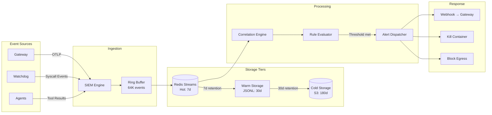
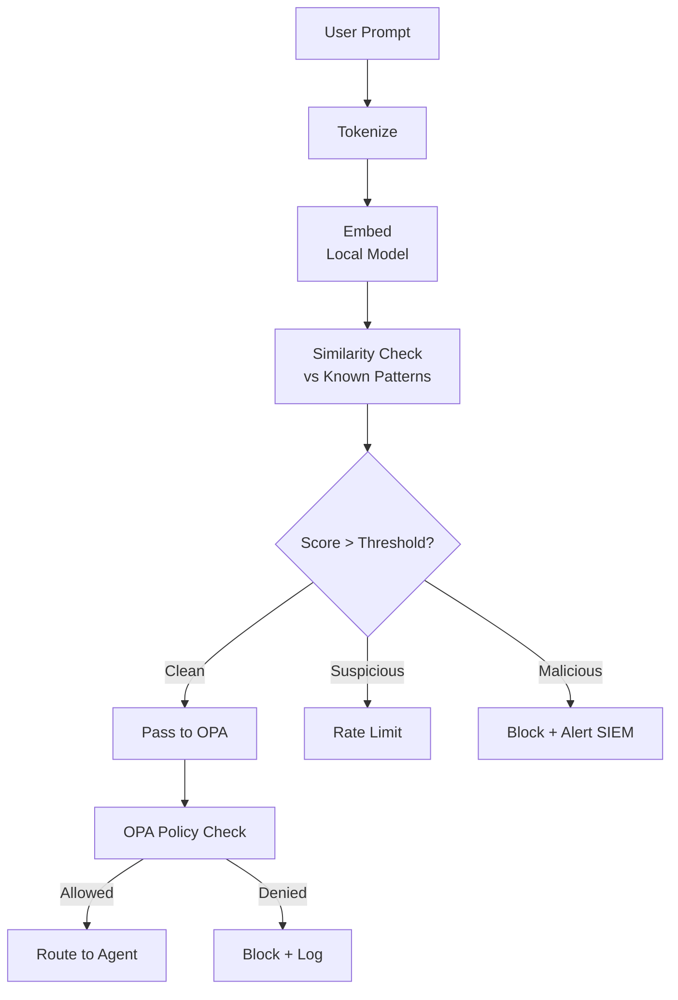
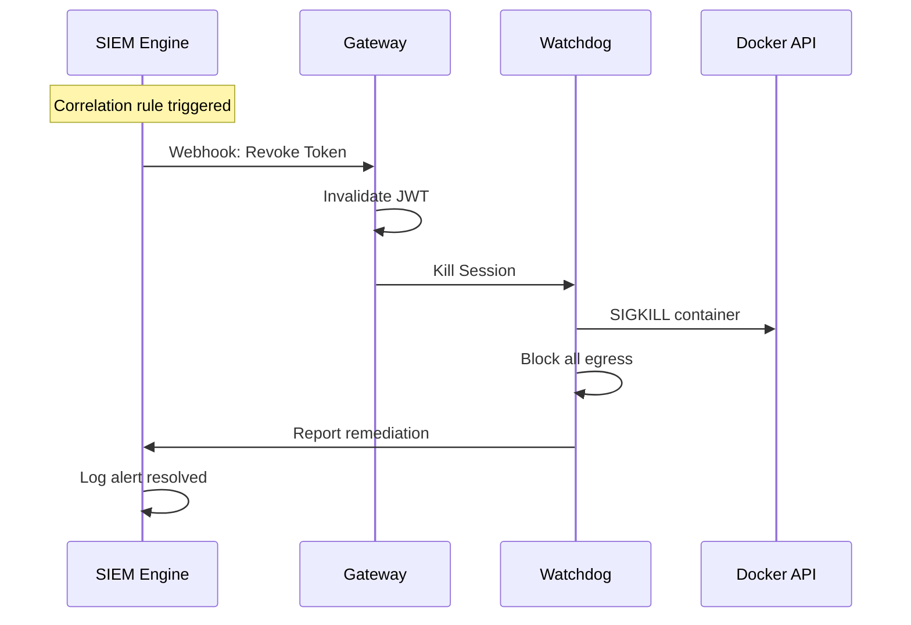

# Data Flow Architecture

## Event Ingestion Pipeline



## Semantic Analysis Pipeline



## Agent Execution Pipeline

```mermaid
flowchart TD
    A[Plan Request] --> B[Planner Agent]
    B --> C[LLM: Generate Steps]
    C --> D[Return PlannedStep[]]

    D --> E{For Each Step}
    E --> F[Executor Agent]
    F --> G[Create Ephemeral Container]
    G --> H[Mount Tool Schema]
    H --> I[Execute Tool Call]
    I --> J[Watchdog: Monitor Syscalls]
    J --> K{Anomaly?}
    K -->|No| L[Collect Result]
    K -->|Yes| M[Kill + Alert]
    L --> N[Report to Gateway]

    N --> O[Summarizer Agent]
    O --> P[LLM: Generate Summary]
    P --> Q[Return Response]
```

## Green Team Auto-Response


