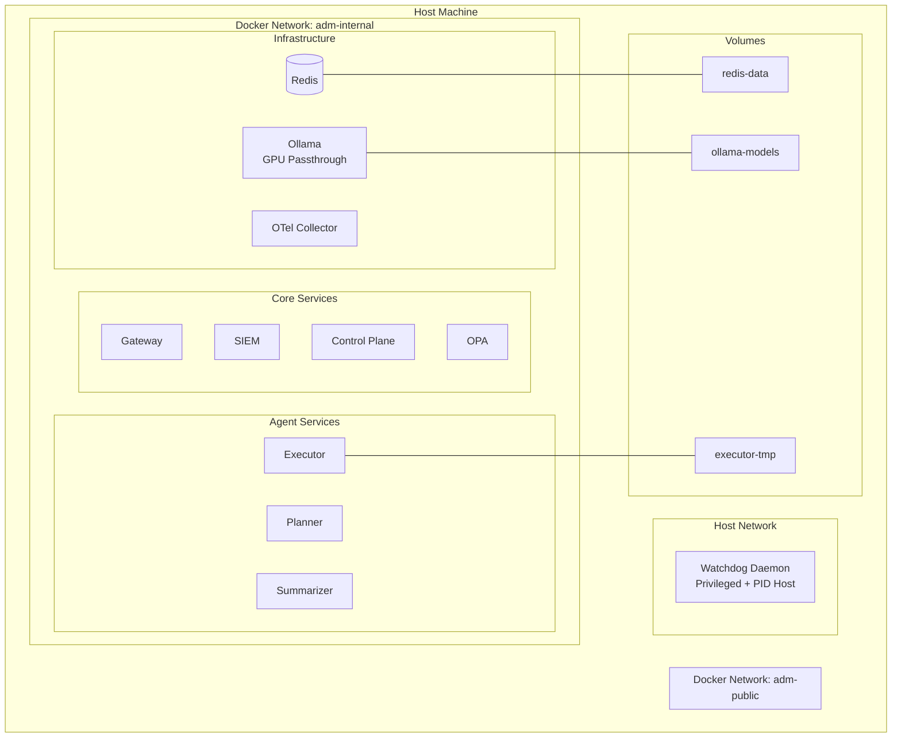
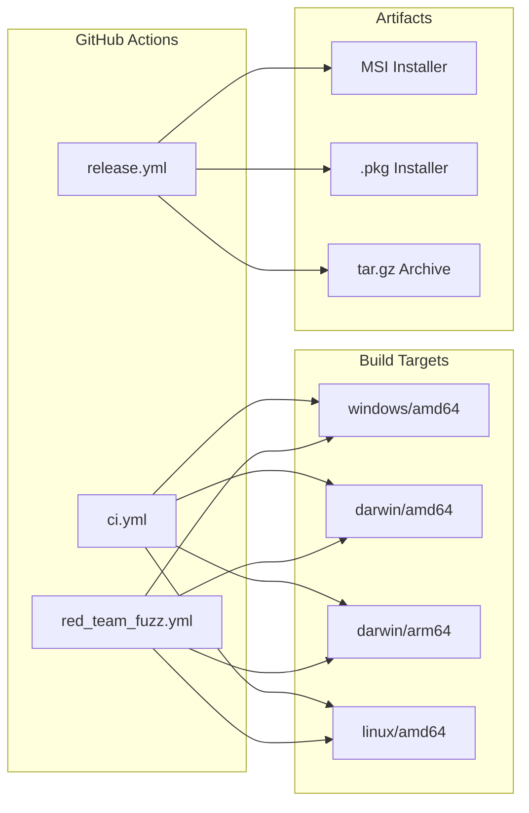

# ADM Deployment Architecture

## Docker Compose Deployment

## GHA Build Matrix

## Installer Matrix

| Platform | Format | Service Manager | Install Path |
|----------|--------|----------------|--------------|
| Windows | MSI | Windows Service | `C:\Program Files\ADM\` |
| macOS | .pkg | launchd | `/Library/ADM/` |
| Linux | tar.gz | systemd | `/opt/adm/` |

## Service Endpoints

| Service | Protocol | Port | Health Check |
|---------|----------|------|--------------|
| Gateway | HTTP/gRPC | 8080/9090 | `GET /v1/health` |
| SIEM | gRPC/HTTP | 9091 | `GET /health` |
| OPA | HTTP | 8181 | `GET /health` |
| Planner | gRPC | 9081 | gRPC health probe |
| Executor | gRPC | 9082 | gRPC health probe |
| Summarizer | gRPC | 9083 | gRPC health probe |
| Control Plane | HTTP | 9092 | `GET /health` |
| Redis | RESP | 6379 | `redis-cli ping` |
| Ollama | HTTP | 11434 | `GET /api/tags` |
| OTel Collector | gRPC/HTTP | 4317/4318 | `:13133/health` |
