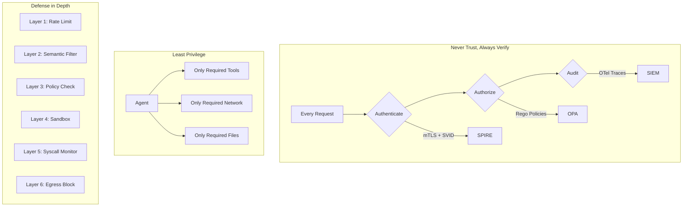
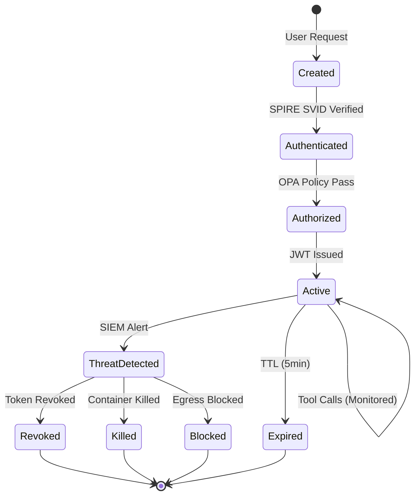
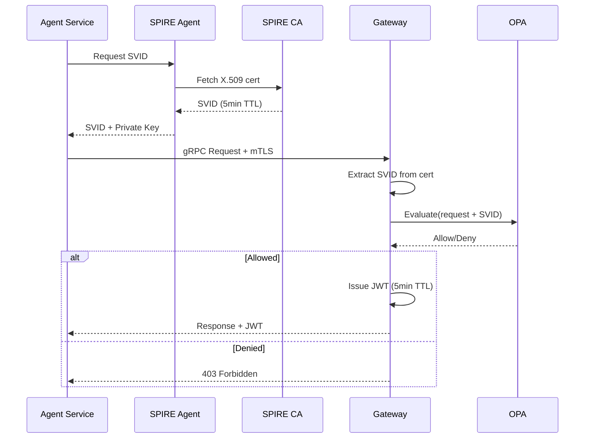
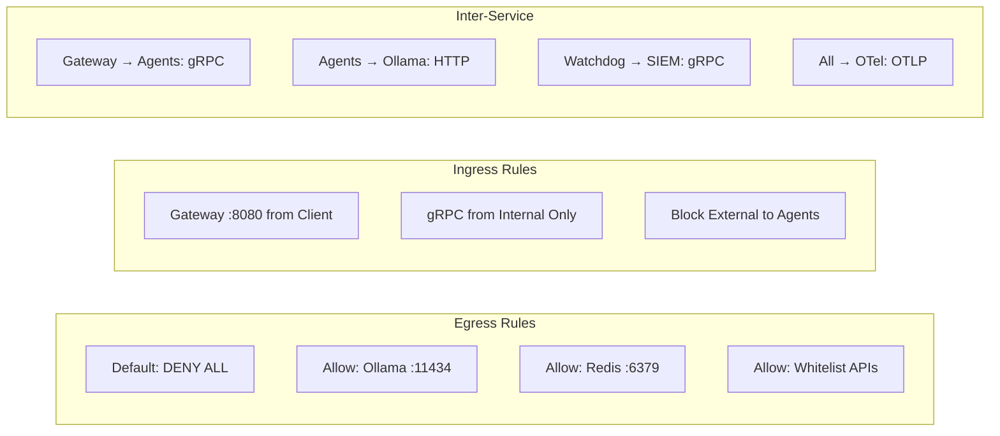

# Security Architecture

## Zero Trust Model

```mermaid
graph TB
    subgraph "Never Trust, Always Verify"
        A[Every Request] --> B{Authenticate}
        B --> C{Authorize}
        C --> D{Audit}

        B -->|mTLS + SVID| E[SPIRE]
        C -->|Rego Policies| F[OPA]
        D -->|OTel Traces| G[SIEM]
    end

    subgraph "Least Privilege"
        H[Agent] --> I[Only Required Tools]
        H --> J[Only Required Network]
        H --> K[Only Required Files]
    end

    subgraph "Defense in Depth"
        L[Layer 1: Rate Limit]
        M[Layer 2: Semantic Filter]
        N[Layer 3: Policy Check]
        O[Layer 4: Sandbox]
        P[Layer 5: Syscall Monitor]
        Q[Layer 6: Egress Block]
    end
```

## Session Lifecycle Security

```mermaid
stateDiagram-v2
    [*] --> Created: User Request
    Created --> Authenticated: SPIRE SVID Verified
    Authenticated --> Authorized: OPA Policy Pass
    Authorized --> Active: JWT Issued

    Active --> Active: Tool Calls (Monitored)
    Active --> ThreatDetected: SIEM Alert

    ThreatDetected --> Revoked: Token Revoked
    ThreatDetected --> Killed: Container Killed
    ThreatDetected --> Blocked: Egress Blocked

    Revoked --> [*]
    Killed --> [*]
    Blocked --> [*]

    Active --> Expired: TTL (5min)
    Expired --> [*]
```

## Credential Flow

```mermaid
sequenceDiagram
    participant Agent as Agent Service
    participant SPIRE as SPIRE Agent
    participant CA as SPIRE CA
    participant GW as Gateway
    participant OPA as OPA

    Agent->>SPIRE: Request SVID
    SPIRE->>CA: Fetch X.509 cert
    CA-->>SPIRE: SVID (5min TTL)
    SPIRE-->>Agent: SVID + Private Key

    Agent->>GW: gRPC Request + mTLS
    GW->>GW: Extract SVID from cert
    GW->>OPA: Evaluate(request + SVID)
    OPA-->>GW: Allow/Deny

    alt Allowed
        GW->>GW: Issue JWT (5min TTL)
        GW-->>Agent: Response + JWT
    else Denied
        GW-->>Agent: 403 Forbidden
    end
```

## Network Security

```mermaid
graph LR
    subgraph "Egress Rules"
        direction TB
        R1[Default: DENY ALL]
        R2[Allow: Ollama :11434]
        R3[Allow: Redis :6379]
        R4[Allow: Whitelist APIs]
    end

    subgraph "Ingress Rules"
        direction TB
        I1[Gateway :8080 from Client]
        I2[gRPC from Internal Only]
        I3[Block External to Agents]
    end

    subgraph "Inter-Service"
        direction TB
        S1[Gateway → Agents: gRPC]
        S2[Agents → Ollama: HTTP]
        S3[Watchdog → SIEM: gRPC]
        S4[All → OTel: OTLP]
    end
```
