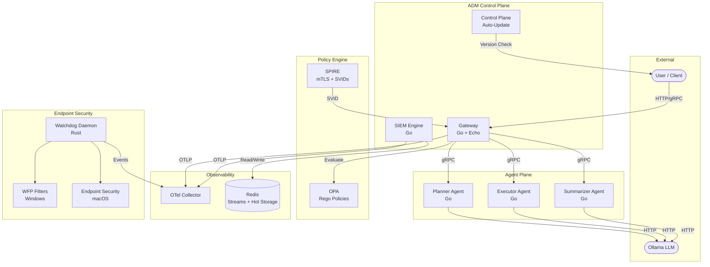
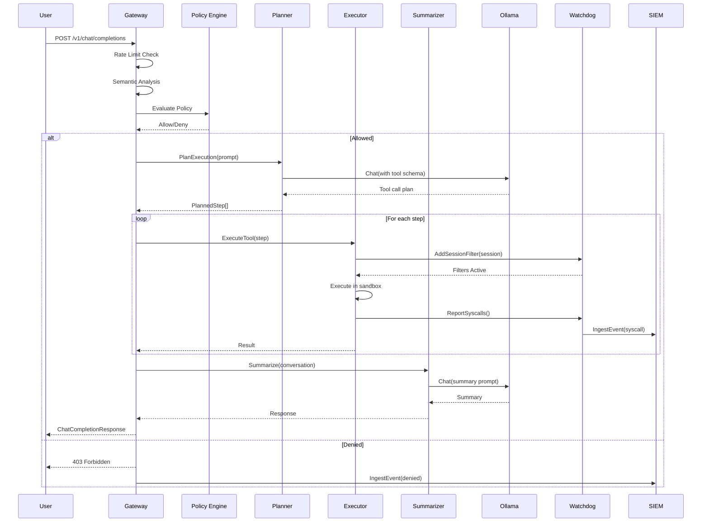
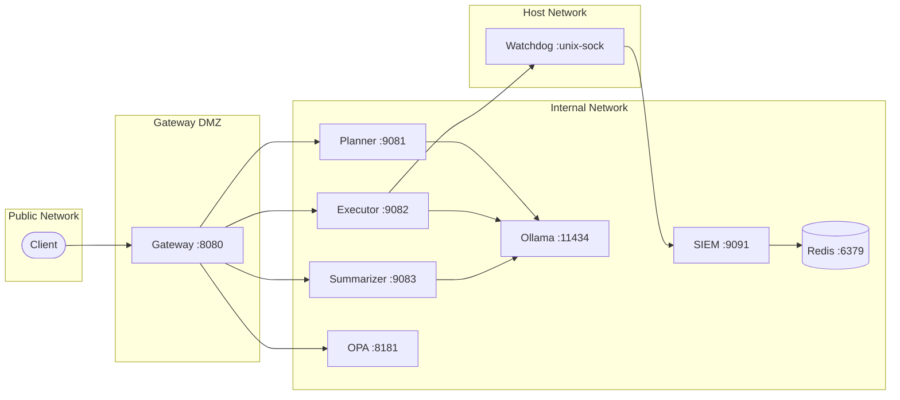
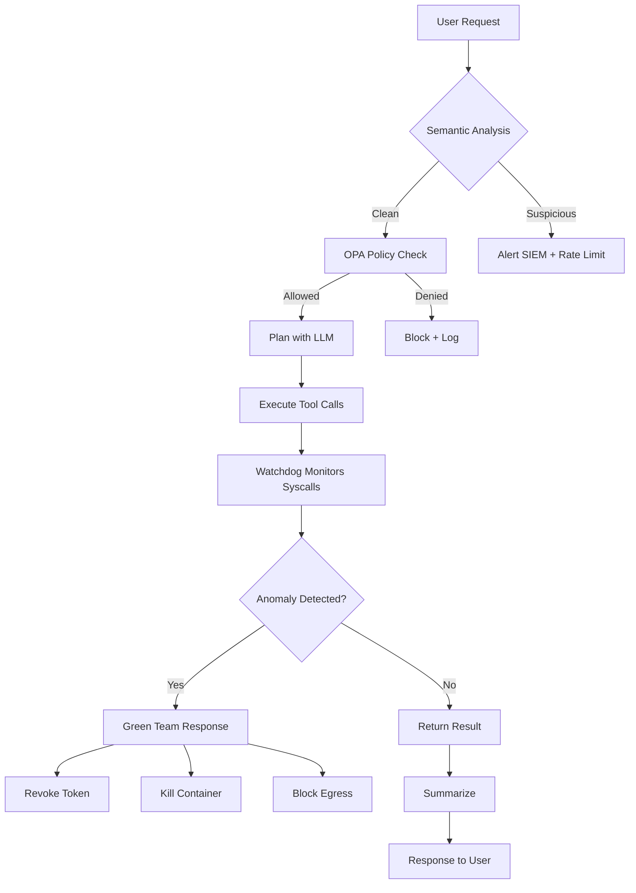

# ADM System Architecture

## High-Level Overview

## Request Flow

## Network Topology

## Data Flow Diagram

## Service Communication Matrix

| Source | Target | Protocol | Port | Purpose |
|--------|--------|----------|------|---------|
| Client | Gateway | HTTP/1.1, HTTP/2 | 8080 | Chat completions |
| Gateway | Planner | gRPC | 9081 | Task planning |
| Gateway | Executor | gRPC | 9082 | Tool execution |
| Gateway | Summarizer | gRPC | 9083 | Response summarization |
| Gateway | OPA | HTTP | 8181 | Policy evaluation |
| Planner | Ollama | HTTP | 11434 | LLM inference |
| Executor | Ollama | HTTP | 11434 | LLM inference |
| Summarizer | Ollama | HTTP | 11434 | LLM inference |
| Executor | Watchdog | Unix socket | — | Syscall reporting |
| Watchdog | SIEM | gRPC | 9091 | Event ingestion |
| SIEM | Redis | RESP | 6379 | Stream storage |
| All | OTel Collector | gRPC | 4317 | Traces/metrics |
| Control Plane | GitHub API | HTTPS | 443 | Auto-update check |
